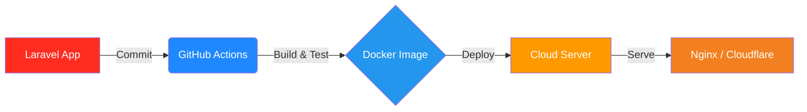

  <h1>Abdulla</h1>
  
<b>Backend Developer | Cloud & DevOps Engineer</b>

  
Architecting scalable backend systems, deploying resilient cloud infrastructure, and automating deployment pipelines.

  
  

    
  

---

## 👨‍💻 About Me

I specialize in building robust server-side applications and the infrastructure required to run them reliably in production. My focus lies at the intersection of **Backend Development** and **Cloud/DevOps Engineering**, where I design APIs, optimize database architecture, configure Linux environments, and build automated CI/CD pipelines. 

My goal is to create systems that are not only functionally complete but also highly available, secure, and easily deployable.

---

## 🛠️ Core Technology Stack

I focus on tools that enable reliable backend logic, secure deployments, and high-performance infrastructure.

**Backend Engineering**
`PHP` `Laravel` `RESTful APIs` `Authentication & Authorization` `Database Architecture`

**Cloud Infrastructure**
`AWS` `Oracle Cloud (OCI)` `DigitalOcean` `Cloudflare`

**DevOps & Deployment**
`Docker` `Nginx` `GitHub Actions` `CI/CD` `Git` `Linux Server Administration`

**Architecture & Scalability**
`Cloud Architecture` `Infrastructure Design` `System Security` `Performance Optimization`

---

## 🏗️ What I Build

- **Scalable Backend Systems:** Architecting and maintaining reliable APIs, SaaS platforms, and business systems.
- **Automated Deployment Pipelines:** Implementing CI/CD workflows to ensure smooth, secure, and repeatable releases.
- **Cloud-Hosted Environments:** Configuring and managing cloud servers, optimizing Nginx, and handling DNS/CDN networks.
- **Containerized Workloads:** Packaging applications in Docker containers for consistent staging and production environments.

### Typical Infrastructure Pipeline

---

## 🚀 Featured Work

> *Note: I prioritize real-world engineering over arbitrary GitHub statistics. Below are examples of systems I've architected and deployed.*

### [LibraryAPI](https://github.com/abdullao0/LibraryAPI) - CI/CD & Infrastructure Project
*A fully automated backend application with production-ready infrastructure.*
- **Stack:** Node.js, Express, Docker, Nginx, CI/CD, Jest
- **Problem:** Manual deployments are error-prone and inconsistent across environments.
- **What I Built:** Engineered a comprehensive CI/CD pipeline, containerized the API with Docker, configured Nginx as a reverse proxy, and implemented automated testing to ensure reliable releases.

### [PMS](https://github.com/abdullao0/PMS) - Product Management System
*A business backend system designed to help small businesses manage their products easily and effectively.*
- **Stack:** PHP, Backend Architecture, Database Design
- **Problem:** Small businesses often struggle with complex, bloated inventory tools.
- **What I Built:** Architected a streamlined backend service tailored for product and inventory management, focusing on clean database design and maintainable API endpoints.

---

## 📈 Current Focus & Learning

While my foundation is built on PHP/Laravel and server administration, my current growth trajectory is heavily focused on the operational side of software engineering.

- **Actively Expanding:** Advanced AWS services, deeper Oracle Cloud (OCI) architecture, and sophisticated Docker orchestration.
- **Exploring:** Highly scalable infrastructure patterns, advanced CI/CD techniques, and robust system security best practices.
